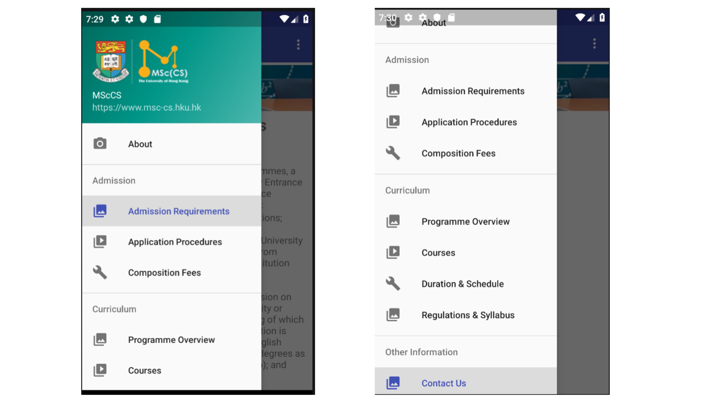

Updated on Oct 31, 2018

# 1.Introduction
This app is a tailor-made mobile environment for MScCS website (https://www.msc-cs.hku.hk).

# 2.Target Users
People who are interested in out MScCS program, especially potential students over the world.

# 3.Features
a. Provide the same set of information as the MSc(CS) homepage
b. Less scroll-up-and-down
c. As simple as possible
d. …

# 4.Development tool(s) and language(s)
IDE: Android Studio
Languages: XML, Java, etc.

# 5.Design
## 5.1 Framework

## 5.2 Navigation
Using DrawerLayout navigation. (https://developer.android.com/training/implementing-navigation/nav-drawer?hl=en)
There are 6 items in msccs website navigator, About, Admission, Curriculum, Graduate&Alumni, News&Events, Student Resources. Each item has a few sub-items except “News&Events”. Therefore, there are 4 options for draw navigation:

a. Main items only. Like twitter and google map’s navigator (figure 1 and figure 2).

b. Sub-items grouping by their main items. Like My Observatory (figure 3).

c. Descending grouping. Like msc-cs webpage in mobile version (figure 4). However, there are very limited documents about how to implement a descending drawer in Android Studio. (https://developer.android.com/training/implementing-navigation/descendant)

Contact item should also be add into the navigator. Since contact information (show on the bottom of each page in the website) has many lines, we should create a stand-alone page for “contact us ” information (figure 5).

## 5.3 Index page / Home page
There are 2 options for index page / home page design:
a. Copy the UI design of msccs home page directly. That may be time consuming and labor consuming. Also, the whole page will be very long.
b. Show all items by groups. User can go into a specific page by clicking an item. Like MTR Mobile (figure 6).
c. Show a limited information only. For example, we can show an index picture and information about program overview only, so that the home page is not too long to scroll in the mobile phone.

Back-to-index button: user can go back to home page by clicking msccs logo on the top of the drawer (figure 7).

## 5.4 Pages
Each page contains various informations such as texts, images, tables. We can design the UI by using multiple layouts based on what kinds of informations in contains. Commonly, most of the pages can be created by LinearLayout.
For reference:
https://blog.csdn.net/llping2011/article/details/9992941
[Android布局实现-ViewPager+Fragment+TabLayout整合](https://tomoya92.github.io/2017/04/05/android-viewpager-fragment-tablayout/)

In our design, all pages are implemented by fragments.

There are 9 fragmets:

# 6.Key techniques
|Function|Tool|
|:--:|:--:|
|Handling menu item clicks|1. FrameLayout
   2. getSupportFragmentManager().beginTransaction().replace(…)|
|Loading HTML |Jsoup|
|Extracting useful information from HTML |Regular Expression
  ( http://en.wikipedia.org/wiki/Regular_expression )|

# 7.UI
## 7.1 Text size

## 7.2 Text Color

# 8.Other ideas
a. 可以将 MSc CS 的几个stream与魔法做对应，比如Financial对应Alchemy炼金术，Cyber Sec对应Defense Against the Dark Arts黑魔法防御。。

(TBD)
